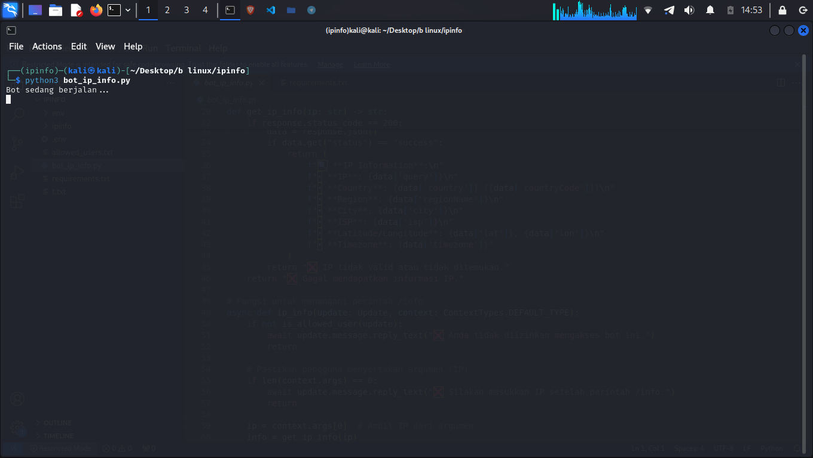
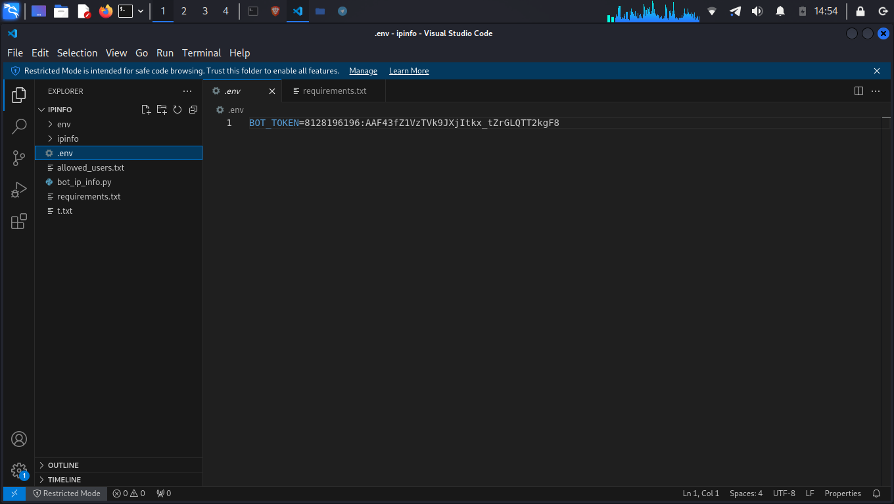
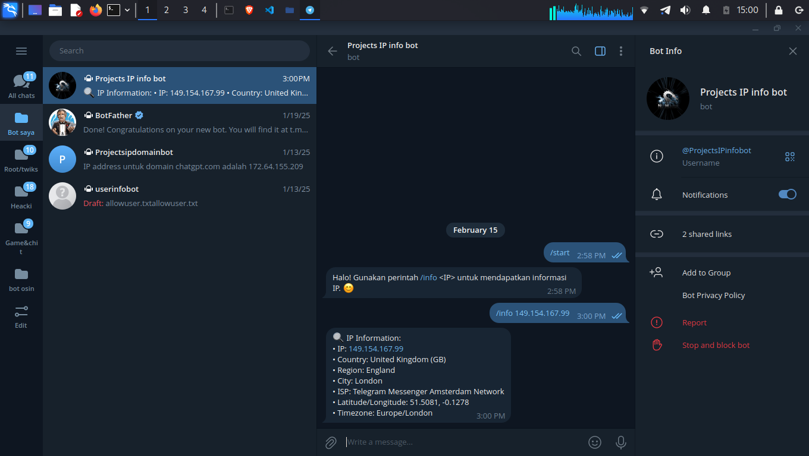
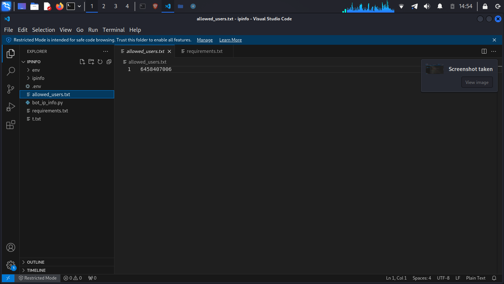

</h1>

<h4 align="center">Alat untuk memperoleh informasi dari alamat IP website. </h4>

<p align="center">

  <a href="http://python.org">
    
  </a>
 

  <a href="https://en.wikipedia.org/wiki/Linux">
    
  </a>

</p>


### Features:

- mengetahui informasi dari ip web
- Negara
- Wilayah
- Kota
- Penyedia Layanan (ISP)
- Garis Lintang/Bujur
- Zona Waktu

<br>

### Platform yang Telah Dicoba

 - OS: Kali GNU/Linux kali-rolling (kali-rolling) x86_64    
  Host: X453SA 1.0
  Kernel: 6.11.2-amd64  
  Packages: 659 (pip), 2904 (dpkg)     
  Shell: zsh 5.9  
  CPU: Intel Celeron N3050 (2) @ 2.1GHz      
  <br>
- OS: Ubuntu 18.04.6 LTS aarch64       
Host: Amlogic Meson GXL (S905X) P212 
Kernel: 5.9.0-arm-64                 
Packages: 465                        
Shell: bash 4.4.20                   
CPU: (4) @ 1.512GHz                  
  
  <br>


### Instalasi di Kali Linux

```
apt update
apt install git
apt install nano 
apt install python3
apt install python3-pip
git clone https://github.com/Aqid191161/ip-info-telegram-bot.git
cd ip-info-telegram-bot
```
 
 ### Configuration File


```
nano allowed_users.txt
```


Setelah muncul 'ID Telegram Anda', gantikan ID Telegram Anda (dalam bentuk angka)


>Anda bisa mendapatkan ID Telegram Anda dengan mengakses bot Telegram yang bernama @userinfobot.

>Catatan: untuk keluar dan menyimpan Configuration File, tekan Ctrl + X, kemudian ketik Y untuk konfirmasi penyimpanan, dan akhiri dengan menekan Enter.

```
nano .env
```
Setelah muncul tulisan 'BOT_TOKEN=token_bot_telegram', ubah 'token_bot_telegram' dengan token bot milik Anda.

<br>

### Instalasi libraries 

```
pip install -r requirements.txt
```
>apabila terjadi error anda dapat mengginstalnya secara manual 
```
pip3 install python-telegram-bot requests python-dotenv
```
<br>

### buat virtual environment (venv)
```
python3 -m venv ip-info-telegram-bot
source ip-info-telegram-bot/bin/activate
```
Jika berhasil, terminal akan menampilkan sesuatu seperti ini
```
┌──(ip-info-telegram-bot)─(kali㉿kali)-[~]
└─$ 
```
<br>

### menjalankan bot

```
python3 ip-info-telegram-bot.py
```

di terminal anda akan melihat pesan bot sedang berjalan itu berarti bot sudah dapat di akses dan di gunakan 👇
 
 <br>

### Screenshot 







## Credits

This project uses the IP information API provided by [ip-api.com](http://ip-api.com).

## Terms of Use

This project uses the [ip-api.com](http://ip-api.com) API to retrieve IP information.
Please note that the free version of the API has rate limits, and commercial use may require a paid plan.

## License

This project is licensed under the Apache License 2.0 - see the [LICENSE](LICENSE) file for details.
